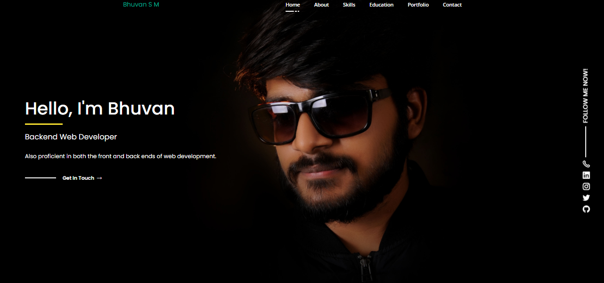
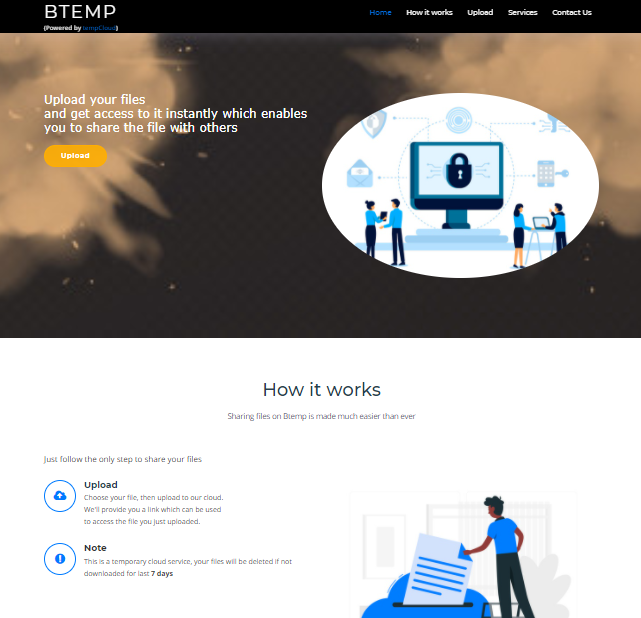

### Hello, geeks 👋

 

 

 

## 📕 Experience
### Web Developer Intern 
##### CodeGeeko Academy Pvt Ltd based in Bengaluru, Karnataka
##### Developed their primary website - [Click here](https://codegeeko.com)
###### October 2020 - December 2020
 

### 📺 My works

 

| | |
|:-------------------------:|:-------------------------:|
|  [Personal Portfolio](https://bhuvan.me) |   [Stats on covid-19 cases](https://sarscov19.ml) |
|||
|||
|||
|  [Real-time Chat Application](https://peer-connect.ml) |   [Temporary Cloud Storage and Service powered by tempCloud](https://btemp.ml) |

### Languages and Tools:

<!-- -->

<!-- -->

  

### Connect with me:

[][website]

[][twitter]
[][linkedin]
[][instagram]

 

[website]: https://bhuvan.me
[twitter]: https://twitter.com/BhuvanSM1

[instagram]: https://www.instagram.com/bhuviism/
[linkedin]: https://www.linkedin.com/in/bhuvan-s-m-55382b196/

<!--
**bhuvism/bhuvism** is a ✨ _special_ ✨ repository because its `README.md` (this file) appears on your GitHub profile.

Here are some ideas to get you started:

- 🔭 I’m currently working on ...
- 🌱 I’m currently learning ...
- 👯 I’m looking to collaborate on ...
- 🤔 I’m looking for help with ...
- 💬 Ask me about ...
- 📫 How to reach me: ...
- 😄 Pronouns: ...
- ⚡ Fun fact: ...
-->
